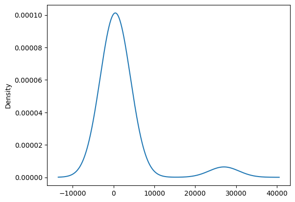
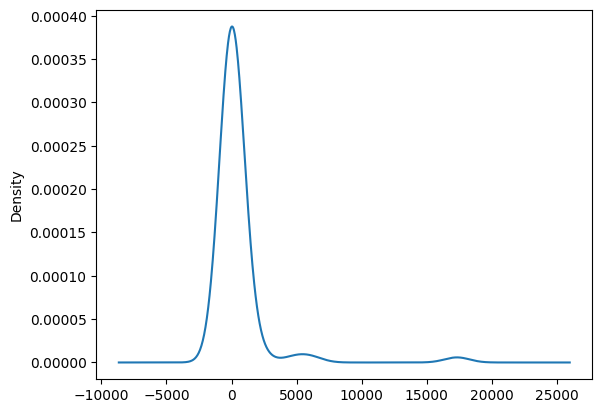
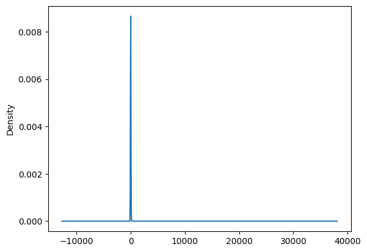

# Neural Network Charity Analysis

## Overview of the loan prediction risk analysis
In this project, with the knowledge of machine learning and neural networks with the TensorFlow platform in Python, we’ll use the features in the provided dataset to create a binary classifier that is capable of predicting whether applicants will be successful if funded by Alphabet Soup. In the process, we will need to compile,train and evaluate the model & finally optimizing the model.

From Alphabet Soup’s business team, the database is from a CSV file ([charity_data](/charity_data.csv)) containing more than 34,000 organizations that have received funding from Alphabet Soup over the years. Within this dataset are a number of columns that capture metadata about each organization, such as the following:

EIN and NAME—Identification columns \
APPLICATION_TYPE—Alphabet Soup application type\
AFFILIATION—Affiliated sector of industry\
CLASSIFICATION—Government organization classification\
USE_CASE—Use case for funding\
ORGANIZATION—Organization type\
STATUS—Active status\
INCOME_AMT—Income classification\
SPECIAL_CONSIDERATIONS—Special consideration for application\
ASK_AMT—Funding amount requested\
IS_SUCCESSFUL—Was the money used effectively

## Results

### Data Preprocessing
- What variable(s) are considered the target(s) for your model? 
  -  IS_SUCCESSFUL is the target of the model in this project.
- What variable(s) are considered to be the features for your model?
  - APPLICATION_TYPE, AFFILIATION, CLASSIFICATION, USE_CASE, ORGANIZATION, STATUS, INCOME_AMT, SPECIAL_CONSIDERATIONS, ASK_AMT
- What variable(s) are neither targets nor features, and should be removed from the input data?
  - IN and NAME are identification information and have been dropped from the analysis.

Images is better displaying the results as below:

### Compiling, Training, and Evaluating the Model
- How many neurons, layers, and activation functions did you select for your neural network model, and why?
  - There are 80 and 30 neurons; 
  - 43 features and 25,724 samplesfor the input;
  - One unique neuron as it is a binary classification for the output layer
- Were you able to achieve the target model performance?
  - The accuracy is below 75% which seems not meet the requirements for predicting the charity donations.
- What steps did you take to try and increase model performance?
  - In this project, it used bucketing to the feature ASK_AMT and organized the different values by intervals.

## Summary 
- As the accuracy of this deep learning neural network model is under 75% which doesn't meet the requirement for predicting  the outcome of the charity donations. Thus, this machine learning model isn't super "smart". 

Recommendations:
- We may incorese the layers to increase the accuracy.
- We may try to use a supervised machine learning model such as the Random Forest Classifier combining a multitude of decision trees to predict the charity donation and compare the accuracy.
